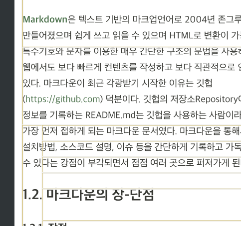

## About React rendering

React를 사용하면서 최적화에 대해 검색해보면 많은 글들이 말한다.

>  컴포넌트 렌더링을 최소한으로 줄여라

리액트를 포함한 많은 SPA에서 DOM에 렌더링하는데 비용이 가장 많이든다.  

리액트 컴포넌트를 완성하고 나서 react dev tool로 컴포넌트 렌더링 되는 지점을 보면, 간혹 실제로 화면상으로 바뀌지 않는 지점이 하이라이트 되는것을 볼 수 있다.





> ~~계속 리렌더링되는 내 컴포넌트~~

React가 렌더링을 실행하는 조건은 다음과 같다.   

- state 변경
- props 변경
- 부모 컴포넌트 렌더링
- forceUpdate가 실행될때
- shouldComponentUpdate에서 true가 반환될때 

부모에서 state, props, forceUpdate가 실행될때 자식도 같이 렌더링이 진행된다.

즉 기본적으로 react는 부모 component로부터 받는 state,props가 변동될 경우 리렌더링 된다.  

하지만 만약 state가 여러개있는데 state1값이 변했는데 state2, state3, state4가 다시 계산되서 렌더링되는 상황이 있을 수 있다.

간단한 구조라면 다행이지만 만약 변경된 state1값에 비해 state2, 3, 4들이 계산하는데 오래걸린다면 상당한 손해가 아닐 수 없다.


## useMemo 


```
/app.js

import Parent from 'Parent';
function App() {
  return (
    <div className="App">
      <Parent name={'홍길동'}/>
    </div>
  );
}

export default App;

```

```
/Parent.js

import { useState } from 'react';
import Child from 'Child';
const Parent = ({ name }) => {
  const [child, setChild] = useState({ name: '춘식', age: 9 });
  const addAge = () => {
    setChild(prev => {
      return {
        ...prev,
        age: prev.age + 1
      }
    })
  }
  const changeName = () => {
    setChild(prev => {
      return {
        ...prev,
        name: prev.name+'춘식'
      }
    })
  }

  return (
    <>
      {`${name}의 아이 `}
      <Child age={child.age} name={child.name} />
      <button onClick={addAge}>자식 나이 +</button>
      <button onClick={changeName}>자식 이름 변경 </button>

    </>
  )
}

export default Parent;

```

```
/Child.js

const getName = (name)=>{
  console.log('이름변경!');
  return `이름${name}`;
}

const getAge = (age) =>{
  console.log('나이변경!');
  return `${age}살`;
}

const Child = ({age, name }) => {
  const renderName = getName(name);
  const renderAge = getAge(age);
 
  return (
    <div>
      <div>{renderName}</div>
      <div>{renderAge}</div>
      
    </div>
  )
}

```

부모 컴포넌트에서 버튼을 누르면 부모의 child state가 수정되어 child state를 props로 받는 Child컴포넌트가 리렌더링되는 코드다.   
그리고 Child컴포넌트에서는 각 name, age에 대해 렌더링 될떄마다 getName, getAge를 실행해 변경된 값을 렌더링한다.


하지만 해당 코드에는 문제가 있다.


자식 나이만 더해도 getName, getAge함수가 호출되고 이름변경버튼도 마찬가지다.  

솔직히 해당코드는 복잡한 로직같은게 없어서 같이 호출되도 상관없으나 만약 한번 계산하는데 오래걸리는 함수였다면 엄청난 낭비다.

이럴경우 useMemo를 사용하면된다. 

```
const memoizedValue = useMemo(() => computeExpensiveValue(a, b), [a, b]);
```
[리액트 공식문서](https://ko.reactjs.org/docs/hooks-reference.html#usememo)의 useMemo페이지에 있는 예시 코드다. 

useMemo는 기본적으로 렌더링 중에 실행된다.   

두번째 인자에 넣는 배열의 값이 변경될때 내부의 함수를 호출해 연산하고, 배열내부의 값이 그대로 일때, 전에 호출했던 연산결과를 재사용한다([memoization](https://ko.wikipedia.org/wiki/%EB%A9%94%EB%AA%A8%EC%9D%B4%EC%A0%9C%EC%9D%B4%EC%85%98)). 

만약 두번째 인자를 비운다면 다른 훅들과 마찬가지로 매번 실행된다.

위 코드에서 메모이제이션 할 값들은 renderName, renderAge다.

```
import {  useMemo } from 'react'

const getName = (name)=>{
  console.log('이름변경!');
  return `이름${name}`;
}

const getAge = (age) =>{
  console.log('나이변경!');
  return `${age}살`;
}

const Child = ({age, name }) => {
  const renderName =useMemo(()=>getName(name),[name]) ;
  const renderAge = useMemo(()=>getAge(age),[age]);

  return (
    <div>
      <div>{renderName}</div>
      <div>{renderAge}</div>
      
    </div>
  )
}

export default Child;
```

이렇게 수정후 버튼을 클릭하면 수정되는 값에만 함수가 호출된다.


예시 코드는 값을 연산하는데 큰 비용이 소모되지 않아, 큰 차이는 없으나 react 예시 코드의 함수명처럼 연산하는데 많은 리소스를 소모 하는 로직일 경우 useMemo를 사용하면 되겠다. 
